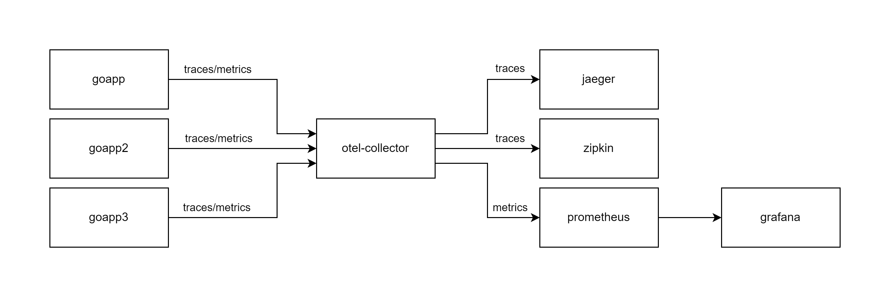

# Implementação de Observabilidade com OpenTelemetry

Este projeto demonstra um ambiente de microsserviços com foco em **observabilidade**, utilizando ferramentas como **Jaeger**, **Zipkin**, **Prometheus**, e **OpenTelemetry Collector**, todos configurados via **Docker Compose**.

> **Importante:** A instrumentação do OpenTelemetry utilizada neste projeto é a manual. Saiba mais em [Instrumentação do OpenTelemetry](https://opentelemetry.io/docs/concepts/instrumentation/?formCode=MG0AV3)

Clique para acessar a Live gravada sobre este projeto - **[A forma certa de implementar observabilidade com OpenTelemetry](https://www.youtube.com/watch?v=LGhrGg-CJ5Y)**

## Arquitetura

O setup contém três microsserviços Go, instrumentados para expor **traces** e **métricas**. O **OpenTelemetry Collector** centraliza a coleta desses dados e os exporta para as seguintes ferramentas de visualização e monitoramento:

- **Jaeger**: Exibição de traces e spans de transações distribuídas.
- **Zipkin**: Exibição e análise de traces de requisições.
- **Prometheus**: Coleta e exibição de métricas dos microsserviços e do OpenTelemetry Collector.

### Componentes

- **goapp**: Serviço Go responsável por simular uma aplicação de microsserviço.
- **goapp2**: Outro microsserviço Go, que faz chamadas externas para o `goapp3`.
- **goapp3**: Terceiro microsserviço Go no pipeline de requisições.
- **Jaeger All-In-One**: Serviço de tracing que coleta e armazena spans.
- **Zipkin All-In-One**: Ferramenta para coletar, armazenar e exibir traces.
- **Prometheus**: Ferramenta de monitoramento de métricas.
- **OpenTelemetry Collector**: Centraliza a coleta de traces e métricas e os distribui para as ferramentas configuradas.

### Fluxo de Observabilidade

Os microsserviços enviam suas métricas e traces ao **OpenTelemetry Collector**, que redistribui esses dados conforme segue:
- Traces para **Jaeger** e **Zipkin**.
- Métricas para **Prometheus**.

### Visualização da Topologia



## Pré-requisitos

- **Docker** e **Docker Compose** instalados na sua máquina.

## Como rodar o projeto

1. Clone o repositório:

    ```bash
    git clone https://github.com/devfullcycle/microsservicos-comunicacao.git
    cd microsservicos-comunicacao
    ```

2. Suba os containers com o Docker Compose:

    ```bash
    docker-compose up --build
    ```

3. Acesse as ferramentas de observabilidade:
   - **Jaeger**: [http://localhost:16686](http://localhost:16686)
   - **Zipkin**: [http://localhost:9411](http://localhost:9411)
   - **Prometheus**: [http://localhost:9090](http://localhost:9090)
   - **Grafana**: [http://localhost:3000](http://localhost:3000)
   - **Otel-collector metrics**: [http://localhost:8888/metrics](http://localhost:8888/metrics)


## Configuração dos Microsserviços

Os microsserviços estão configurados para expor métricas e traces usando o OpenTelemetry:

   - **Goapp /metrics**: [http://localhost:8080/metrics](http://localhost:8080/metrics)
   - **Goapp2 /metrics**: [http://localhost:8181/metrics](http://localhost:8181/metrics)
   - **Goapp3 /metrics**: [http://localhost:8282/metrics](http://localhost:8282/metrics)

Cada um dos microsserviços realiza chamadas externas simuladas e envia traces para o OpenTelemetry Collector.

## Configuração do OpenTelemetry Collector

O `OpenTelemetry Collector` recebe os dados dos microsserviços via OTLP (gRPC) e os exporta para:
- **Jaeger** na porta `14250`
- **Zipkin** na porta `9411`
- **Prometheus** na porta `8889`

## Licença

Este projeto é licenciado sob os termos da licença ...
